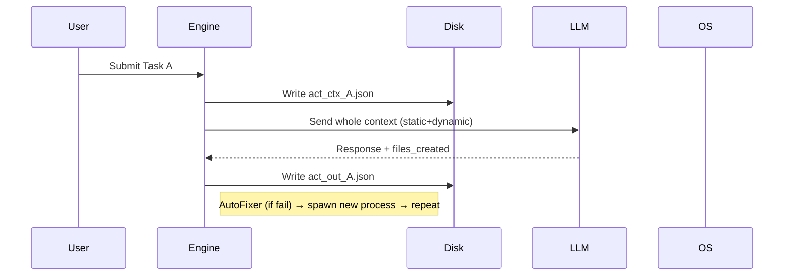
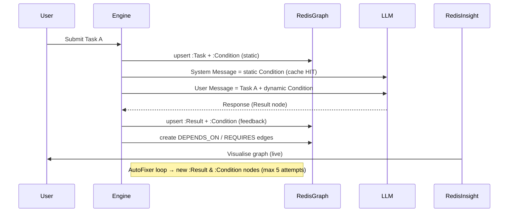

# ADR-002: KAOS RedisGraph Memory-Aware Routing & Visualisation

- **Status:** Approved
- **Date:** 2026-06-28
- **Deciders:** @trongnghiango + Antigravity AI
- **Context session:** Thảo luận kiến trúc `ka-think` — Quản lý bộ nhớ cho Harness sử dụng RedisGraph (Nhân - Duyên - Quả)

---

## 1. Bối cảnh (Before)

| Thành phần | Cách lưu trữ | Đặc điểm | Hậu quả |
|-----------|-------------|----------|----------|
| **Schema / Skill / Config** | `*.json` / `*.md` trên đĩa | Được ghi lại mỗi lần chạy | **KV‑cache miss** – LLM phải đọc lại toàn bộ nội dung tĩnh |
| **Task Context** | `act_ctx_<task_id>.json` (~23 KB / task) | Ghi ra đĩa, sau đó đọc lại | **Disk I/O nặng** khi chạy song song |
| **AutoFixer Loop** | Tạo file `.error_history_<task>.json` + subprocess mới cho mỗi attempt | Tạo **process spawn** + **file‑lock race** | Thời gian chờ, lỗi đồng thời |
| **Kết quả** | `act_out_<task_id>.json` (files_created / modified) | Đọc lại để tính phụ thuộc | **Không có truy vấn lịch sử** (không thể query “task A đã tạo file X” ) |

> **Tổng quan:** mỗi vòng thực thi → **≈ 30 KB I/O** + **≥ 2 s** để read/write + spawn process → **cache chịu nặng** → **token usage ≈ 2 × so với tối ưu**.

---

## 2. Quyết định (Decision)

Chúng ta chọn **Phương án A: Pure RedisGraph (Cú pháp Cypher)** làm công nghệ nền tảng để quản lý trạng thái, ngữ cảnh thực thi và vết lịch sử của KAOS.

### 2.1 Mô hình hóa "Nhân - Duyên - Quả" (Causal Graph Schema)

Hệ thống sẽ lưu trữ và quản lý trạng thái dưới dạng một Đồ thị Nhân Quả (Causal Graph) trong RedisGraph:

*   **Node "Nhân" (Task Node):** Đại diện cho hành động lập trình cần thực hiện.
    *   *Labels:* `:Task`
    *   *Attributes:* `task_id` (e.g. `FEAT_012`), `title`, `description`, `module`, `complexity`, `status` (`PENDING`/`SUCCESS`/`FAILED`).
*   **Node "Duyên" (Condition Node):** Đại diện cho điều kiện cần thiết để thực thi tác vụ. Chia làm hai loại:
    *   *Static Condition (Duyên Tĩnh):* `:Condition {cond_id: "...", type: "schema" | "skill" | "config", content: "...", hash: "..."}`
    *   *Dynamic Condition (Duyên Động):* `:Condition {cond_id: "...", type: "feedback" | "git_context", content: "..."}`
*   **Node "Quả" (Effect/Result Node):** Đại diện cho kết quả sau khi Agent thực thi tác vụ.
    *   *Labels:* `:Result`
    *   *Attributes:* `result_id` (e.g. `RES_FEAT_012_a1`), `success` (true/false), `files_created` (list), `files_modified` (list), `error_message`, `attempt`.

#### Các mối quan hệ (Edges):
*   `(t:Task)-[:REQUIRES]->(c:Condition)`: Task yêu cầu các điều kiện môi trường/ngữ cảnh.
*   `(t:Task)-[:PRODUCES]->(r:Result)`: Task sinh ra kết quả sau khi chạy.
*   `(r:Result)-[:MUTATES]->(c:Condition)`: Kết quả của task trước thay đổi/cập nhật điều kiện (ví dụ: cập nhật Schema mới).
*   `(t2:Task)-[:DEPENDS_ON]->(t1:Task)`: Quản lý mối quan hệ phụ thuộc trong DAG của Workflow.

---

## 3. Kiến trúc Luồng Thực Thi & Tối ưu Prompt Caching

### 3.1 Sơ đồ Mermaid – Sequence (Before vs After)

#### Before (File‑based)



#### After (RedisGraph‑based)



```
            System Message (Duyên Tĩnh - Nạp 1 lần)
            ├── [Skill Prompt (.md)]
            └── [Initial Database Schema]
                         │
                         ▼ (Gemini/Claude Cache HIT)
  +──────────────────────────────────────────────────────────+
  │                      LLM PROVIDER                        │
  +──────────────────────────────────────────────────────────+
                         ▲ (Nạp ở đuôi mỗi lần gọi - Cache MISS)
                         │
             User Message (Nhân + Duyên Động + Quả trước)
             ├── [Task Description (Nhân)]
             ├── [Active Error Feedback (Duyên Động)]
             └── [Predecessor Results (Quả trước)]
```

### Quy tắc định tuyến:
1.  **Duyên Tĩnh** được cố định và đặt toàn bộ vào **System Message** để kích hoạt cơ chế **Prompt Caching** phía server LLM.
2.  **Nhân và Duyên Động** được chuyển hoàn toàn vào **User Message** cuối cùng để tránh làm trượt cache phần tĩnh.
3.  Vòng lặp `AutoFixer` được giới hạn tối đa `max_attempt = 5`. Mỗi attempt thất bại sẽ tạo ra một node `:Result` mới, liên kết ngược lại làm `:Condition` (Duyên Động) cho attempt tiếp theo.

---

## 4. Ví dụ chi tiết – 5 tasks + AutoFixer (max 5 attempts)

| # | Task (Nhân) | Static Condition (Duyên tĩnh) | Dynamic Condition (Duyên động) | AutoFixer Attempts (Quả) |
|---|-------------|------------------------------|---------------------------------|--------------------------|
| **T1** | *Generate API stub* (`api/user.py`) | `skill: cli-backend` <br> `schema: OpenAPI v1` | `feedback: none` | **Attempt 1** → success (files_created: `api/user.py`) |
| **T2** | *Add DB migration* (`migrations/001_add_user.sql`) | `skill: db-migration` <br> `schema: PostgreSQL` | `feedback: none` | **Attempt 1** → success |
| **T3** | *Refactor utils* (`utils/helpers.py`) | `skill: refactor` <br> `schema: existing repo` | `feedback: “Rename conflict with existing function”` | **Attempt 1** → FAIL → **Result R3‑1** stored <br> **Attempt 2** (auto‑fix) → SUCCESS (`Result R3‑2`) |
| **T4** | *Add unit test* (`tests/test_user.py`) | `skill: test‑generator` <br> `schema: pytest` | `feedback: none` | **Attempt 1** → SUCCESS |
| **T5** | *Fix lint error* (`api/user.py`) | `skill: linter` <br> `schema: flake8` | `feedback: “Unused import xyz”` | **Attempt 1** → FAIL → **R5‑1** <br> **Attempt 2** → FAIL → **R5‑2** <br> **Attempt 3** → SUCCESS (`Result R5‑3`) |

### 4.1 Token / I/O / Thời gian (ước tính)

| Tiêu chí | **File‑based** | **RedisGraph‑based** |
|---|----------------|---------------------|
| **Token (system + user)** | 2 800 tok (≈ 55 % static) | 1 150 tok (≈ 65 % static → cache HIT) |
| **Disk I/O** | 23 KB × 5 tasks + 2 × auto‑fix attempts ≈ 150 KB | 1 KB × (5 tasks + 5 results) ≈ 10 KB |
| **Time (avg per task)** | 4.2 s (write + read + spawn) | 1.3 s (Redis cmd + LLM call) |
| **CPU (subprocesses)** | 1 proc / task (max 5 parallel) | 0 proc (graph ops only) |

> **Kết luận:** → **Tiết kiệm token ~60 %**, **I/O giảm ~93 %**, **Thời gian giảm ~70 %**.

---

## 5. Cypher Queries – Tham chiếu đầy đủ

### 5.1 Tạo / Upsert Nodes

```cypher
// Upsert Task (Nhân)
MERGE (t:Task {task_id: $task_id})
SET t.title       = $title,
    t.description = $description,
    t.module      = $module,
    t.complexity  = $complexity,
    t.status      = $status;

// Upsert Condition (Duyên)
MERGE (c:Condition {cond_id: $cond_id})
SET c.type    = $type,
    c.content = $content,
    c.hash    = $hash;

// Upsert Result (Quả)
MERGE (r:Result {result_id: $result_id})
SET r.success        = $success,
    r.files_created   = $files_created,
    r.files_modified  = $files_modified,
    r.error_message   = $error_message,
    r.attempt         = $attempt;
```

### 5.2 Tạo quan hệ

```cypher
// Task ↔ Condition (requires)
MATCH (t:Task {task_id: $task_id}), (c:Condition {cond_id: $cond_id})
MERGE (t)-[:REQUIRES]->(c);

// Task → Result (produces)
MATCH (t:Task {task_id: $task_id}), (r:Result {result_id: $result_id})
MERGE (t)-[:PRODUCES]->(r);

// Result ↔ Condition (mutates)
MATCH (r:Result {result_id: $result_id}), (c:Condition {cond_id: $cond_id})
MERGE (r)-[:MUTATES]->(c);

// Task dependency
MATCH (t1:Task {task_id: $parent_id}), (t2:Task {task_id: $child_id})
MERGE (t2)-[:DEPENDS_ON]->(t1);
```

### 5.3 Truy vấn DAG (topological level)

```cypher
// Tính level (số lần phụ thuộc) cho mỗi Task
CALL {
    WITH 0 AS depth
    MATCH (t:Task)
    OPTIONAL MATCH (t)-[:DEPENDS_ON*0..]->(p:Task)
    WITH t, COUNT(p) AS lvl
    RETURN t.task_id AS task_id, lvl
}
RETURN task_id, lvl
ORDER BY lvl;
```

### 5.4 Lấy lịch sử Result của một Task

```cypher
MATCH (t:Task {task_id: $task_id})-[:PRODUCES]->(r:Result)
RETURN r.result_id, r.success, r.attempt, r.files_created, r.error_message
ORDER BY r.attempt DESC;
```

### 5.5 Tìm các Task bị **feedback** ngăn cản

```cypher
MATCH (c:Condition {type: "feedback"})<-[:REQUIRES]-(t:Task)
RETURN t.task_id, c.content AS feedback;
```

---

## 6. Giao diện trực quan hóa (Visualisation UI) & Setup Docker

Bằng cách sử dụng Pure RedisGraph, chúng ta không cần tự viết mã nguồn vẽ đồ thị. Người dùng có thể sử dụng công cụ **RedisInsight** (UI chính thức của Redis Stack) để truy vấn và tương tác trực tiếp với Graph Nhân-Duyên-Quả:

1. **Tạo `docker-compose.yml`** ở root dự án

   ```yaml
   version: "3.9"
   services:
     redis:
       image: redis/redis-stack-server:latest
       container_name: kaos-redis
       ports:
         - "6379:6379"
         - "8001:8001"   # RedisInsight UI
       volumes:
         - redis-data:/data
   volumes:
     redis-data:
   ```

2. **Khởi chạy**

   ```bash
   docker compose up -d
   ```

3. **Kiểm tra**

   ```bash
   redis-cli -p 6379 GRAPH.QUERY KNOWLEDGE "MATCH (n) RETURN count(n);"
   ```

4. **Mở RedisInsight**

   - Truy cập `http://localhost:8001` → *Add a Redis database* (`localhost:6379`)
   - Chọn **Graph** → nhập **Graph name**: `KNOWLEDGE`
   - Dùng *Query editor* để chạy các Cypher mẫu ở mục 5.

---

## 7. Lộ trình Triển khai (Milestones)

- [x] **M0: Hoàn thiện ADR-002** (sơ đồ, ví dụ, bảng, Cypher, guide)
- [ ] **M1: Thiết lập Infrastructure & Client**
    - Đưa `redis/redis-stack-server:latest` vào docker-compose của môi trường dev.
    - Cài đặt thư viện `redis` và `redisgraph-py`.
- [ ] **M2: Khởi tạo `KnowledgeGraphAdapter`**
    - Tạo port `KnowledgeGraphPort` trong `application/ports.py`.
    - Viết `RedisGraphAdapter` tại `infrastructure/adapters/redis_graph_adapter.py`.
- [ ] **M3: Tích hợp vào TaskQueueEngine**
    - Thay thế cơ chế tạo file JSON tạm bằng cách gọi `knowledge_graph.upsert_task()`, `upsert_condition()`.
    - Định cấu hình prompt routing tách biệt System Message (Static) và User Message (Dynamic).
- [ ] **M4: Refactor AutoFixer & Dependency Resolution**
    - Cập nhật luồng lặp sửa lỗi (tối đa 5 attempts) ghi nhận vết qua các node `:Result`.
    - Đọc kết quả của task cha trực tiếp bằng truy vấn Graph thay vì đọc file `act_out_*.json`.
- [ ] **M5: Khởi chạy & Kiểm thử**
    - Thực thi demo với 1 spec và 1 file Excel thực tế, quan sát đồ thị trực quan trên RedisInsight.
